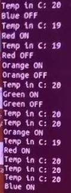

The task is to use UART3 and buttons to change LEDs status using the buttons on the board or commands coming from the computer using UART3, and display the current state of the LED on the screen, in addition to this, it is necessary to display the current temperature on the screen with a certain periodicity.
Solution: Using the buttons, the status of the LEDs is switched: blue - GPIO_PIN_15, green - GPIO_PIN_9, orange - GPIO_PIN_8, red - GPIO_PIN_14, the status is also controlled using commands from the computer coming using UART3, 0 - green, 1 - orange, 2 - red, 3 - blue, once every 5 seconds, when the state of the LED changes, its status is displayed on the screen. the current temperature is displayed on the user's screen using UART3 and an external temperature sensor.

