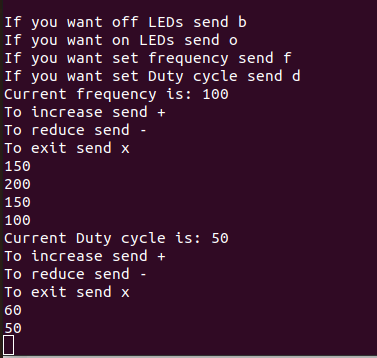

The task is to create a library of functions to control certain parameters: turn on / off the LEDs, change the frequency and duty cycle
Solution: a library of functions has been created that is controlled by UART3 and I2C, with the following commands: "b" - turn off the LEDs, "o" - turn on the LEDs, "f" - set the frequency of the LEDs, "d" - set the duty cycle, set the frequency and the duty cycle is canceled with the commands "+", "-", and "x" to exit the parameter setting. Commands are transmitted using UART3.

