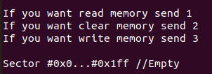

The task is to read the time capsule located in the SPI Serial Flash memory, after which the capsule must be cleared and rewritten.
Solution: the write, read and clear functions are controlled using commands coming from the user using UART3, 1 - for reading memory, 2 - for clearing, 3 for writing, unfortunately reading showed that the memory was empty.

